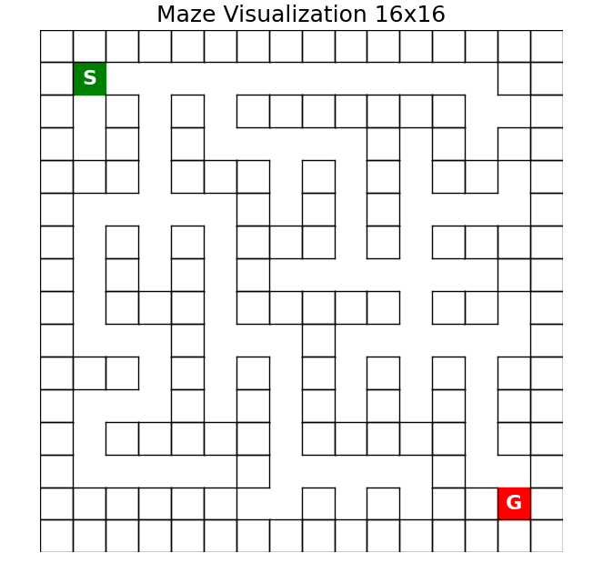
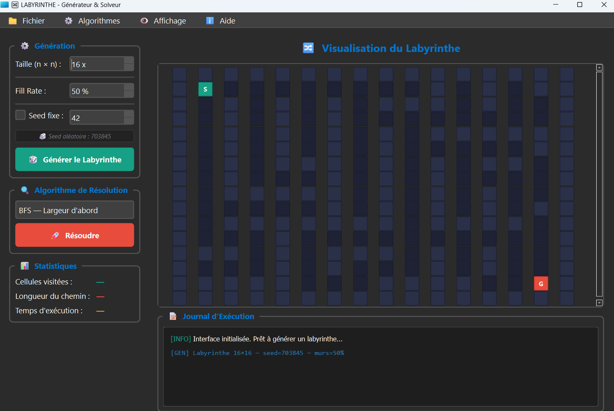

# Maze Search Algorithms – INF-5183

## Overview

This project implements fundamental **Artificial Intelligence search algorithms** to solve a classical path-finding problem in a maze.

The goal is to automatically find a path from a **start position (S)** to a **goal position (G)** inside a maze while avoiding obstacles.

Three algorithms are implemented and compared:

* **Breadth-First Search (BFS)**
* **Depth-First Search (DFS)**
* **A* Search (A-Star)** using the **Manhattan heuristic**

The project also includes a **random maze generator** that guarantees the existence of a valid path between the start and the goal.

This work was developed as part of the course:

**INF-5183 – Foundations of Artificial Intelligence**

---

# Problem Description

The maze is represented as a **2D grid** where:

| Symbol | Meaning         |
| ------ | --------------- |
| `#`    | Wall (obstacle) |
| `.`    | Free cell       |
| `S`    | Start position  |
| `G`    | Goal position   |

Example of maze representation **8X8**:

```
# # # # # # # #
# S . . # . . #
# . # . . . . #
# . # # # . # #
# . . . . . . #
# # # . # # . #
# . . . . . G #
# # # # # # # #
```

Allowed movements:

* Up
* Down
* Left
* Right

Diagonal moves are **not allowed**.

---

# Project Structure

```


📁 INF-5183
  ├─╴📁 src
  |    └─╴📄 astar.py
  |    └─╴📄 bfs.py
  |    └─╴📄 dfs.py
  |    └─╴📄 maze.py 
  ├─╴📁 test
  |    └─╴📄 test_astar.py
  |    └─╴📄 test_bfs.py
  |    └─╴📄 test_dfs.py
  |    └─╴📄 test_maze.py
  └─╴📄 main.py
  └─╴📄 launch.bat
  └─╴📄 README.md
  └─╴📄 requirements.txt
  └─╴📄 Devoir_I.pdf
  └─╴📄 .gitignore

```

---

# Algorithms Implemented

## Depth-First Search (DFS)

DFS explores the maze **as deep as possible** before backtracking.

Characteristics:

* Uses a **stack (LIFO)**
* Does **not guarantee the shortest path**
* Often explores fewer nodes but may produce longer paths

Exploration order:

```
Right → Down → Left → Up
```

---

## Breadth-First Search (BFS)

BFS explores the maze **level by level**.

Characteristics:

* Uses a **queue (FIFO)**
* Guarantees the **shortest path**
* Usually explores more nodes than DFS

---

## A* Search Algorithm

A* is an **informed search algorithm** that combines:

* the cost from the start `g(n)`
* an estimate to the goal `h(n)`

Evaluation function:

```
f(n) = g(n) + h(n)
```

Heuristic used:

**Manhattan Distance**

```
h(n) = |x_n - x_goal| + |y_n - y_goal|
```

A* typically finds the **optimal path faster** than BFS by guiding the search toward the goal.

---

# Maze Generation

The maze generator creates a **16 × 16 grid** with the following properties:

* Outer borders are always **walls**
* Internal walls are placed **randomly**
* Start position `S` is located at **(1,1)**
* Goal position `G` is located near the **bottom-right corner**
* A **valid path between S and G is guaranteed**
* A **random seed** can be used for reproducibility

---

# Visualization

Example of the graphical visualization of the maze and the path to from G to S.

- **Green cell**: Start position (S)  
- **Red cell**: Goal position (G)    



# Program Output

For each algorithm the program displays:

### Maze Exploration

Visited cells are marked with:

```
p
```

### Final Path

The solution path is marked with:

```
*
```

Example output:

```
Chemin : S(1,1) → (2,1) → (3,1) → ... → G(14,14)
```

### Statistics

The program also reports:

* Number of explored nodes
* Length of the path
* Execution time (milliseconds)

---

# Performance Comparison

Example comparison table:

| Algorithm      | Explored Nodes | Path Length | Time (ms) |
| -------------- | -------------- | ----------- | --------- |
| DFS            | 78             | 45          | 0.521     |
| BFS            | 112            | 27          | 0.634     |
| A* (Manhattan) | 45             | 27          | 0.312     |

---

# Installation

Clone the repository:

```
git clone https://github.com/TecHenri/INF-5183.git
```

Move into the project directory:

```
cd INF-5183
```

# Usage CLI Mode (No GUI Required)

You can run the project directly from a Windows terminal using:

```
main.bat
```

or 
Install dependencies :

```
pip install -r requirements.txt
```


Run the program with:

```
python main.py
```


The program will:

1. Generate a random maze
2. Run DFS
3. Run BFS
4. Run A*
5. Display the results and statistics

---

# Requirements

* Python **3.11**
* Standard Python libraries

No external libraries are required.

---


## Interface graphique (IHM)

L'interface a été développée avec **PySide6 (Qt 6)** en suivant le model **MVC** :




### Architecture MVC

```
main.py
  └── MainWindow          (widgets/main_window.py)
        ├── Ui_MainWindow (ui/ui_main_window.py)   — Vue Qt Designer
        ├── GridWidget    (widgets/grid_widget.py)  — Rendu labyrinthe
        └── MazeController(widgets/controller.py)   — Logique & connexions
```

| Couche     | Fichier(s)                          | Rôle                                              |
|------------|-------------------------------------|---------------------------------------------------|
| Model      | `src/maze.py`, `src/bfs.py` …       | Génération et algorithmes — aucune dépendance Qt  |
| View       | `ui/ui_main_window.py`, `grid_widget.py` | Affichage — aucune logique métier           |
| Controller | `widgets/controller.py`             | Orchestre Model ↔ View, connecte les signaux Qt   |

### Fonctionnalités

| Fonctionnalité                        | Description                                                  |
|---------------------------------------|--------------------------------------------------------------|
| **Génération**                        | Taille N×N (2–30), taux de murs (0–100 %), seed fixe ou aléatoire |
| **Choix d'algorithme**                | BFS, DFS, A\* via liste déroulante                           |
| **Visualisation en temps réel**       | Animation pas-à-pas des cellules explorées                   |
| **Affichage du chemin**               | Chemin final marqué en orange (★) après résolution           |
| **Statistiques**                      | Cellules visitées, longueur du chemin, temps d'exécution     |
| **Journal d'exécution**               | Log coloré de toutes les actions (génération, résolution)    |
| **Barre de progression**              | Suivi visuel de l'avancement de l'animation                  |
| **Sauvegarde**                        | Export du labyrinthe en `.txt` via le menu Fichier           |

### Palette de couleurs

| Couleur   | Signification         |
|-----------|-----------------------|
| Vert      | Départ (S)            |
| Rouge     | Arrivée (G)           |
| Bleu foncé| Cellule visitée       |
| Orange    | Chemin final (★)      |
| Bleu-gris | Mur                   |
| Gris foncé| Cellule libre         |


### GUI Mode (Optional)

To launch the graphical interface:

```
app.bat
```
This will automatically install PySide6 if it is not already installed


# Educational Purpose

This project aims to:

* Understand **uninformed search algorithms**
* Understand **heuristic search**
* Compare algorithm **efficiency and optimality**
* Practice **algorithm implementation in Python**

---

# Author

**Yao Henri Kouassi**

Master's Student
Université du Québec en Outaouais

Course:

**INF-5183 – Foundations of Artificial Intelligence**

Instructor:

**Mohamed Lamine ALLAOUI**
